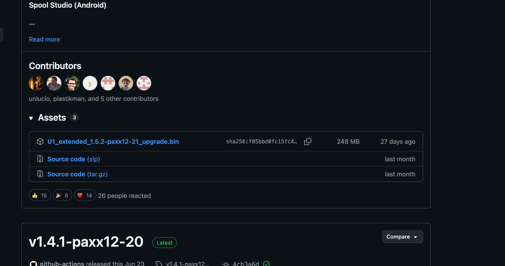
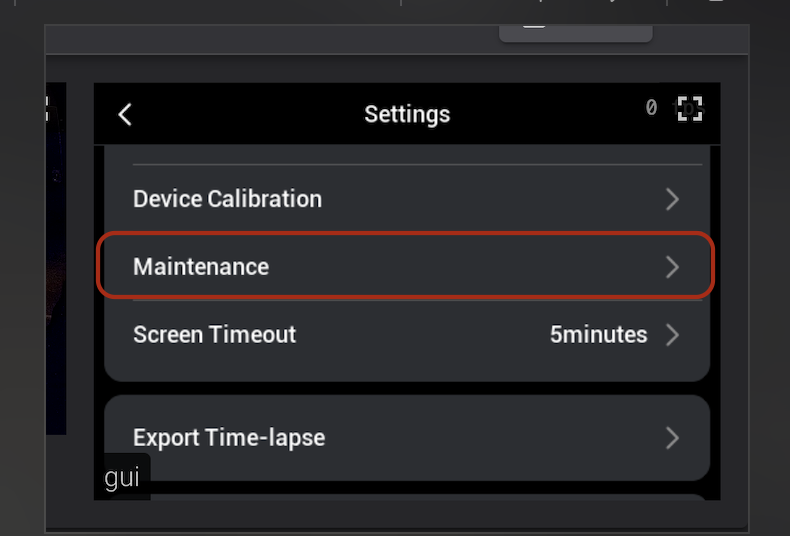
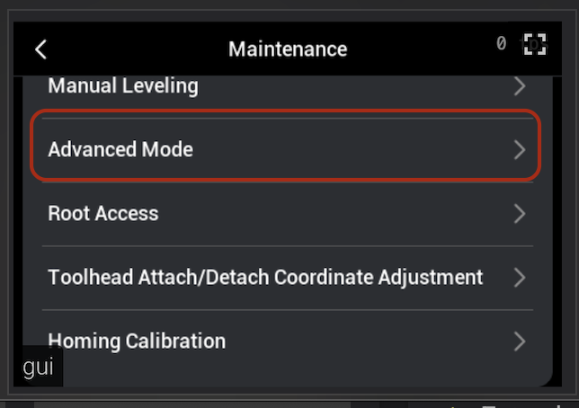
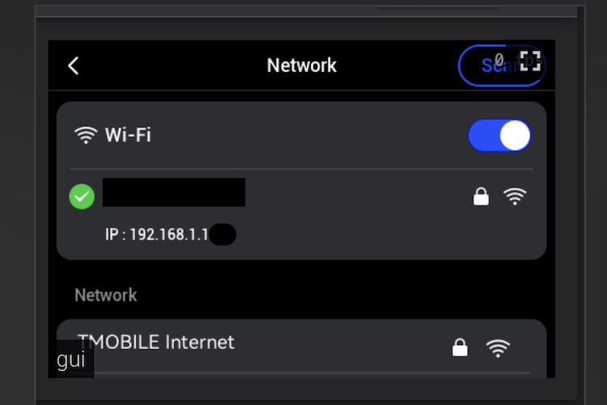
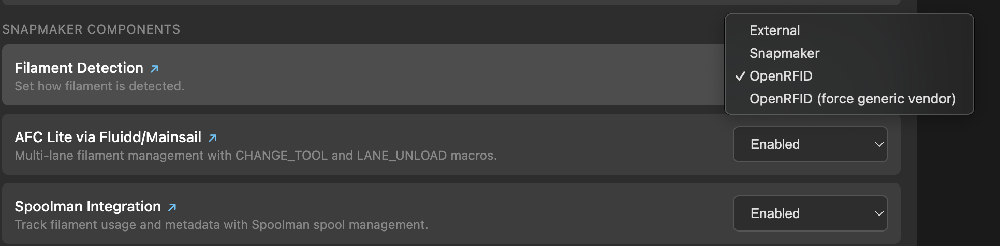
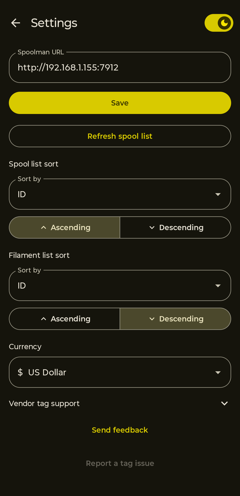
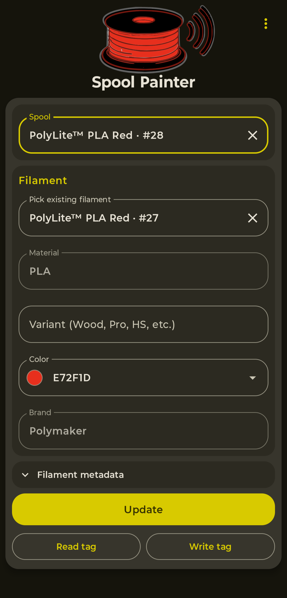
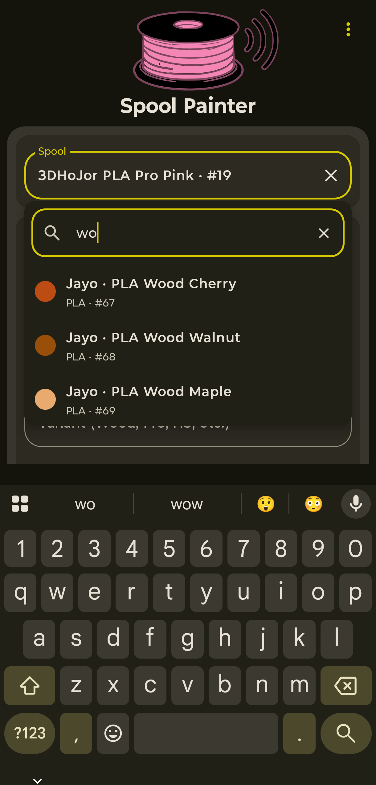
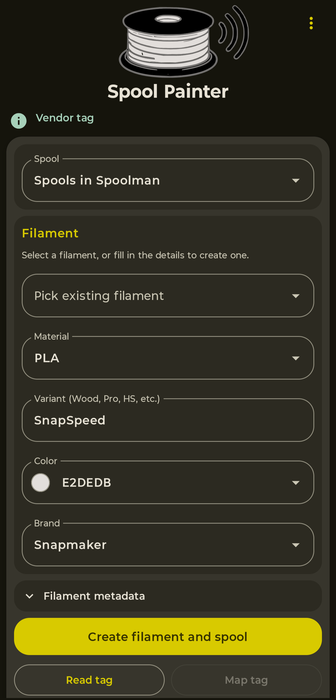
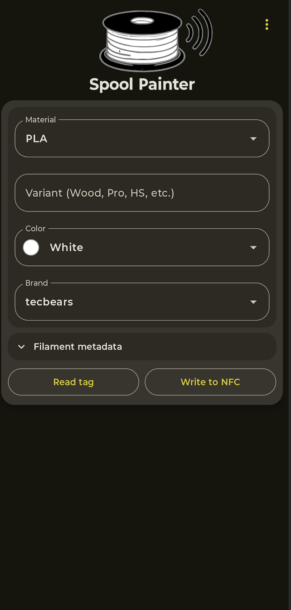

# NFC Tags & Spoolman Setup Guide

<sub>by [ni4223](https://github.com/ni4223)</sub>

Put an NFC tag on a spool and the printer recognises it the moment you load it,
brand, material and colour filled in for you, while
[Spoolman](https://github.com/Donkie/Spoolman) counts down how much filament is
left.

**Only want the printer to recognise your spools?** You don't need Spoolman. Do
section 1, then in section 3 set Filament Detection to OpenRFID and leave Spoolman
Integration off. Then go straight to
[section 5](#5-writing-tags-without-spoolman).

Factory tags on Snapmaker, Anycubic and QIDI spools are read directly, nothing to
write. For Bambu, Creality and Elegoo, the app can read the factory tag and copy
it onto a blank tag, which the printer then reads without any extra setup. See
[RFID Format & Reader Design](design/rfid.md).

## Contents

- [1. Extended firmware](#1-extended-firmware)
- [2. Spoolman](#2-spoolman)
- [3. Enable Spoolman and filament detection](#3-enable-spoolman-and-filament-detection)
- [4. Writing tags with the app](#4-writing-tags-with-the-app)
- [5. Writing tags without Spoolman](#5-writing-tags-without-spoolman)
- [6. Filament Manager](#6-filament-manager)

## 1. Extended firmware

Grab the firmware from the
[Releases page](https://github.com/paxx12-snapmaker-u1/SnapmakerU1-Extended-Firmware/releases).
Look for the release with the green **Latest** badge, not whatever sits at the
top of the page, that one's usually a pre-release. Open **Assets** and download
the file ending in `_upgrade.bin`, around 250 MB. Ignore the source code files.



### Installing the firmware

Covered in the [Installation Guide](install.md).

While you're at the printer, turn on Advanced Mode. It's off by default and you'll
need it for the settings page later. On the touchscreen go to **Settings** and
open **Maintenance**:



Then **Advanced Mode**, turn it on, and restart the printer:



## 2. Spoolman

Skip this if you only want the printer to recognise your spools, see the note at
the top.

Spoolman is a database of your filament. It's not part of the firmware, you run it
yourself. I run mine on a Raspberry Pi, but anything will do: a NAS, an old
laptop, a mini PC, your desktop. The only real requirement is that it's switched
on when you're printing, otherwise the printer has nothing to look up.

Set it up now, before you go any further, using the
[Spoolman installation guide](https://github.com/Donkie/Spoolman/wiki/Installation).
You'll end up with a web page at `http://<server-ip>:7912`. Get that far and come
back here.

The printer talks to it over your network, so it has to be reachable from the
printer, not just from your laptop. Give that machine a fixed IP too, or a
reservation on your router, because if the address changes the printer quietly
stops finding your spools.

## 3. Enable Spoolman and filament detection

Open `http://<printer-ip>/firmware-config/` in a browser. The printer's IP is in
the network settings on the touchscreen, something like `192.168.1.50`. If the
page won't load, Advanced Mode isn't on yet, go back to section 1.



Go to **Settings** > **Snapmaker Components**.



**Filament Detection.** Set it to **OpenRFID**. It reads far more tag formats
than the stock reader does, including factory tags from Bambu, Elegoo, Creality
and others. More on that in [RFID Format & Reader Design](design/rfid.md).

**AFC Lite via Fluidd/Mainsail.** Set it to **Enabled**. This is what gives you
the four lanes in Fluidd or Mainsail, showing which spool is loaded where. See
[AFC-Lite](afc-lite.md).

**Spoolman Integration.** Set it to **Enabled** and type in the Spoolman address
from section 2, with the `http://` and the port:

```
http://192.168.1.100:7912
```

The printer checks it can actually reach Spoolman before it saves, so if you get
an error the address is wrong or Spoolman isn't running. Once it goes through,
Klipper and Moonraker restart themselves and are back in a few seconds. No reboot
needed.

## 4. Writing tags with the app

Buy some **NTAG215** or **NTAG216** tags. The SnapSpeed spool that came with the U1
already has a Snapmaker tag on it, so you can check the reading and mapping
workflow before yours arrive.

The steps below use
[SpoolPainter](https://play.google.com/store/apps/details?id=com.spoolpainter.app).

Other community apps do the same job, they're listed on the
[community apps page](spoolman.md#apps).

### Point the app at Spoolman

Open **Settings**, paste your Spoolman address, and hit **Save**.

### Tag a new spool

1. Fill in **brand**, **material** and **colour**.
2. Hold a blank tag against the phone.

The spool is created in Spoolman and the tag is written in one go.

### Tag a spool that's already in Spoolman

1. Open the spool picker and type into the search box. Material, brand, colour or
   the Spoolman ID all work.
2. Pick the spool, then hold your tag against the phone.

| Settings | New spool | Search |
|---|---|---|
|  |  |  |

### Put a tag on each side

The reader sits inside the printer housing, so a tag only gets read if it's facing
it. With one tag that means always loading the spool the same way round, so use
two. After the first write the app offers to pair another.

Tags can be reused, nothing to unmap first. If the tag already belongs to another
spool, the app asks when you write it and moves it over for you.

### Vendor tags

Bambu, Snapmaker, QIDI, Anycubic, Elegoo and Creality tags are read and fill the
form in for you. Pairing those is by UID, nothing is written to the chip.

Bambu and Creality need a one time setup per brand under **Settings** first.



## 5. Writing tags without Spoolman

You don't need Spoolman to get spools recognised. Leave the Spoolman address blank
in **Settings** and the spool and filament pickers disappear, leaving just the
filament fields.

Fill those in, hit **Write to NFC**, and hold a tag to the phone. The printer picks
the filament details straight off the tag. What you lose is Spoolman: the inventory
and the remaining weight tracking.



## 6. Filament Manager

Open `http://<printer-ip>/filament/` to see what the printer thinks is loaded. You
get a card per extruder with the brand, material and colour it picked up, and a
badge saying where that came from: the tag itself, Spoolman, or something you typed
in by hand.


**Read spool tags** re-reads all four channels, handy after you've swapped a spool
and want to check the tag took. If Spoolman is connected there's also a button on
each card to pick a spool by hand, which is the way to do it if you haven't got
your phone nearby.
